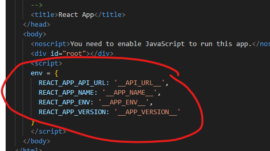

# Web Application Delivery Recommendations #

This is a summary of popular methods for incorporating the "Build once, deploy everywhere" principal of DevOps when delivering a client-side rendered or single page application on Azure. There are many different frameworks that can be used to develop these types of applications and include React JS, Angular, NextJS, etc. Here, we will be focusing on React JS but these principles are transportable to a number of other similar frameworks. 

A collection of additional strategies for managing environment-specific configurations in React applications is listed below, along with the pros and cons of each approach. The primary goal of this guidance however, is to recommended a simple approach for dealing with the challenge of providing environmental configuration at release time. The overall focus is to ensure the suggested approach has a low level of complexity and overall impact to existing codebases.

 

## Single Page Applications ##

In static web applications, the configuration is baked in at build time, meaning you most likely need to create individual build artifacts for dev, test, uat, live etc. This can turn into a significant time sink if the build process is even remotely lengthy.

In a ReactJS (create-react-app) application, we commonly utilise different configuration parameters using the "REACT_APP" .env properties — but those must be set at compile time. Create-react-app expects you to rebuild the application for each target environment, and although this violates the principle mentioned above, it seems that it is the most common approach nowadays. What if you want, or need, to follow the build once, deploy many principle?

The goal is to decouple environment-specific configuration from the build process, allowing the same build artifact to be deployed to multiple environments with different configurations.

There are a number of different strategies to achieve this goal but some of the most popular are listed below with their relative effort/complexity, pros and cons.
  

## Recommended Approach ##

The numerous strategies listed below each have there own benefits and drawbacks, however I feel **[8. Injecting Global Variables](#8.-injecting-global-variables)** is the easiest to understand and requires minimal effort to take advantage of the approach with an existing codebase. Simply add the some javascript either in a seperate .js file or directly into index.html hosted in your public folder and they will be globally available using the window object.

This first example shows how to define the environment variables in a separate file that is not processed by Webpack. 

This file is then included in the public folder of the React application and is loaded in the index.html file. 

This particular strategy has been implemented in the [deploy.sh](deploy.sh) script in this repository. The script is used to deploy the application to an Azure App Service using zip deploy. The example includes a step to update the env.js file containing the environment variables directly in the deployment zip before publishing it to the Azure App Service. In this way, the environment variables can be updated without rebuilding the application.

Alternatively, you can use placeholders in the index.html file to define the environment variables and replace them with the actual values during deployment:

As discussed above, traditional apps such as React, embed the environment variables in the build and in that case, they are accessed using **process.env**. In our case, we will be loading the small script block containing the variables at the very start of the application's lifecycle and they will become available using the **window** object in the following manner:

Note the use of the Nullish coalescing operator (??) to provide a default value in case the environment variable is not defined. 

With these changes in place, you can now deploy the production build of your React application but all of the environment variables will be defined in the unbundled/non-minified public folder. Use any search and replace tool to find the placeholders or substitute an entire .js file, depending on your chosen approach. After the server hosting the static web app is restarted, the values will be in effect.

 

## A Working Example ##

The [deploy.sh](deploy.sh) shell script in this repository is a working example of how to deploy a React application to an Azure App Service using zip deploy. The script includes a step to update the env.js file containing the environment variables directly in the deployment zip before publishing it to the Azure App Service. In this way, the environment variables can be updated without rebuilding the application.

To execute the script, you will need to update the following variables at the top of the script:

- **UNIQUE_BASE_NAME**: A unique base name for the Azure resources (e.g., my-test-app).
- **SUBSCRIPTION**: The Azure subscription ID.

Additionally, you can specify the region to deploy into, however this will default to Australia East if not set.

- **REGION**: The path to the deployment zip file containing the React application build.

Executing the script will build, deploy, and update the environment variables in the React application without rebuilding it. The script will pause to indicate the initial state before updating it to its final state:

Note: The script was developed to be executed under a bash shell on the Windows Subsystem for Linux (WSL) or a Linux environment. The first step installs an extra dependency to ensure it hast the ability to load a window from the Windows default browser. It may require modifications to run on other platforms.
  

## Additional Approaches ##

**1. Dynamic Configuration via Public Folder**:
   - **Approach**: Store environment-specific configuration files like `config.js` in the public folder of the React application, which is not processed by Webpack.
   - **Effort**: Moderate setup effort to organize configuration files and modify the build pipeline.
   - **Pros**: Simplifies the CI/CD pipeline by using the same build for all environments.
   - **Cons**: Configuration files are publicly accessible, which might be a security concern.
   - **Source**: Discussed in the [Cevo blog](https://cevo.com.au/post/how-to-build-once-and-deploy-many-for-react-app-in-ci-cd/).

**2. Environment Variable Injection at Runtime**:
   - **Approach**: Use tools like React-Inject-Env to inject environment variables into the application at runtime rather than during the build process.
   - **Effort**: Requires initial setup in the CI/CD pipeline to ensure correct variable injection.
   - **Pros**: Highly flexible and allows for last-minute configuration changes.
   - **Cons**: May require additional tooling or setup in the deployment environment.
   - **Source**: [A Build Once, Deploy Many Implementation Guide for React Apps with GitHub Actions and React-Inject-Env](https://medium.com/@liamhp/build-once-deploy-many-for-react-apps-with-github-actions-and-react-inject-env-f56aa78ffa44)

**3. External Configuration File**:
   - **Approach**: Use an external `config.json` that is fetched at application startup to load configuration dynamically.
   - **Effort**: Low to moderate effort, involving creating and managing the config file outside the build process.
   - **Pros**: Easy to update without needing to rebuild or redeploy the application.
   - **Cons**: Potential delay in application startup due to the fetch operation.
   - **Source**: Explained in detail on [mikesir87's blog](https://blog.mikesir87.io/2021/07/build-once-deploy-everywhere-for-spas/).

**4. Using CI/CD Pipeline for Environment Switching**:
   - **Approach**: Automate the switching of environment configurations during the deployment phase without rebuilding.
   - **Effort**: High setup effort to script and test the CI/CD pipeline steps.
   - **Pros**: Builds are consistent across all environments; reduces build time.
   - **Cons**: Complexity in pipeline setup and maintenance.
   - **Source**: Commonly referenced in discussions about DevOps practices for SPAs.

**5. Server-Side Rendering for Dynamic Injects**:
   - **Approach**: Use server-side rendering to dynamically inject environment variables into the application at runtime.
   - **Effort**: High due to the need for server-side capabilities and additional coding.
   - **Pros**: Offers greater control over environment-specific configurations.
   - **Cons**: Increases complexity and resource usage of the application.
   - **Source**: Discussed in the context of React and [Redux documentation](https://redux.js.org/usage/server-rendering#inject-initial-component-html-and-state).

**6. Webpack Environment Plugin**:
   - **Approach**: Utilize Webpack's EnvironmentPlugin to manage environment variables during the build process.
   - **Effort**: Moderate effort to configure Webpack appropriately.
   - **Pros**: Integrates smoothly into existing Webpack builds, easy to use once set up.
   - **Cons**: Still requires a build per environment if variables are used in the code directly.
   - **Source**: Detailed in [Webpack's official documentation](https://webpack.js.org/plugins/environment-plugin/).

**7. Containerization**:
   - **Approach**: Package the application in a container that can be deployed across any environment.
   - **Effort**: High initial effort to set up Docker or other container technologies.
   - **Pros**: Highly portable and consistent across all deployment environments.
   - **Cons**: Requires container management and orchestration knowledge.
   - **Source**: General knowledge and best practices in cloud-native development.

**8. Injecting Global Variables**:
   - **Approach**: Consider all static assets as immutable and utilise the public scope to host an index.html that is unique to each environment. By including versioned references to the web application static assets and setting the environment variables in the index.html, it effectively becomes a deployment manifest.
   - **Effort**: Low to medium effort to update index.html in your deployment process for each environment and update code to use window.env rather than process.env. 
   - **Pros**: Highly portable and consistent across all deployment environments.
   - **Cons**: Configuration files are publicly accessible, which might be a security concern.
   - **Source**: [Injecting Data from the Server into the Page](https://create-react-app.dev/docs/title-and-meta-tags/#injecting-data-from-the-server-into-the-page)

**9. Global Variables + Pre-rendering**:
   - **Approach**: As an extension of the previous approach, you can use a pre-rendering service to inject the environment variables into the index.html file before serving it to the client. This can be achieved in a number of ways such as [Server-side Rendering (SSR) with ASP.NET Core](https://learn.microsoft.com/en-us/aspnet/core/client-side/spa/react?view=aspnetcore-8.0&tabs=visual-studio), [Azure Static Web Apps Snippets](https://learn.microsoft.com/en-us/azure/static-web-apps/snippets) or [Server-side Includes (SSI)](https://learn.microsoft.com/en-us/iis/configuration/system.webserver/serversideinclude) in Azure App Service.
   - **Effort**: Medium effort and impact depending on the pre-rendering technique chosen but has the same requirement update code to use window.env rather than process.env. 
   - **Pros**: Highly portable and consistent across all deployment environments and environment variables are incorporated by the server rather than requiring major changes to the client-side code.
   - **Cons**: Depending on the method chosen, there may be additional complexity involved in moving to a new platform such as Azure Static Web Apps.
   - **Source**: 
      - [Server-side Rendering (SSR) with ASP.NET Core](https://learn.microsoft.com/en-us/aspnet/core/client-side/spa/react?view=aspnetcore-8.0&tabs=visual-studio)
      - [Azure Static Web Apps Snippets](https://learn.microsoft.com/en-us/azure/static-web-apps/snippets)
      - [Server-side Includes (SSI)](https://learn.microsoft.com/en-us/iis/configuration/system.webserver/serversideinclude)
 

## References ##

How to "Build Once and Deploy Many" for React App in CI/CD - Cevo
https://cevo.com.au/post/how-to-build-once-and-deploy-many-for-react-app-in-ci-cd/

A Build Once, Deploy Many Implementation Guide for React Apps with GitHub Actions and React-Inject-Env | by Liam Patty | Medium
https://medium.com/@liamhp/build-once-deploy-many-for-react-apps-with-github-actions-and-react-inject-env-f56aa78ffa44

Build Once and Deploy Everywhere for SPAs – mikesir87's blog
https://blog.mikesir87.io/2021/07/build-once-deploy-everywhere-for-spas/

Build once, deploy many in React | Profinit blog
https://profinit.eu/en/blog/build-once-deploy-many-in-react-dynamic-configuration-properties/

React Application: Build Once, Deploy Anywhere Solution - DEV Community
https://dev.to/eamonnprwalsh/react-application-build-once-deploy-anywhere-solution-507m

Environment Variables in JavaScript: process.env
https://dmitripavlutin.com/environment-variables-javascript/

Managing Front-end JavaScript Environment Variables
https://robertcooper.me/post/front-end-javascript-environment-variables

Title and Meta Tags | Create React App
https://create-react-app.dev/docs/title-and-meta-tags/#generating-dynamic-meta-tags-on-the-server

reactjs - How to inject pod environment variables values into React app on runtime? - Stack Overflow
https://stackoverflow.com/questions/70085518/how-to-inject-pod-environment-variables-values-into-react-app-on-runtime

EnvironmentPlugin | webpack
https://webpack.js.org/plugins/environment-plugin/

Server Rendering | Redux
https://redux.js.org/usage/server-rendering#inject-initial-component-html-and-state

The Most Common XSS Vulnerability in React.js Applications | by Emelia Smith | Node Security | Medium
https://medium.com/node-security/the-most-common-xss-vulnerability-in-react-js-applications-2bdffbcc1fa0

Injecting Data from the Server into the Page | Create React App
https://create-react-app.dev/docs/title-and-meta-tags/#injecting-data-from-the-server-into-the-page

---

